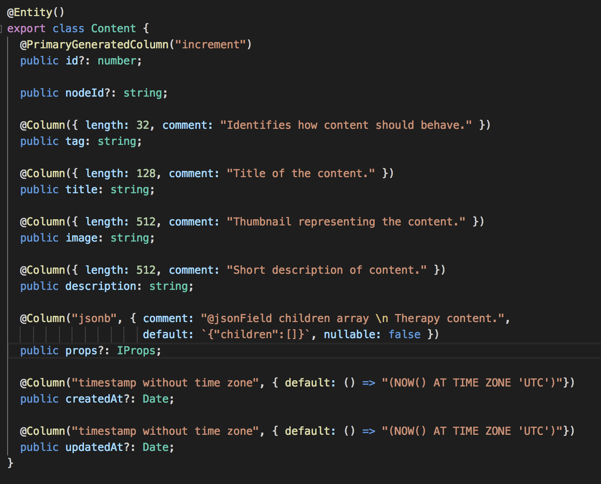
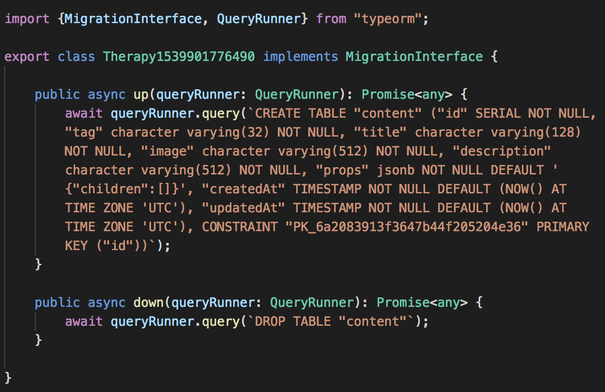
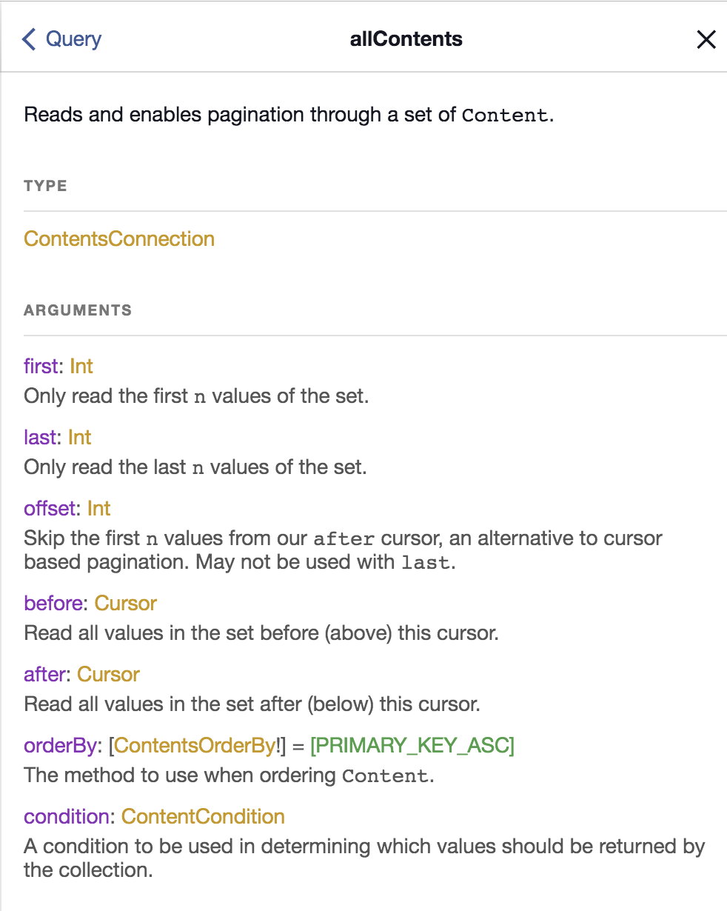
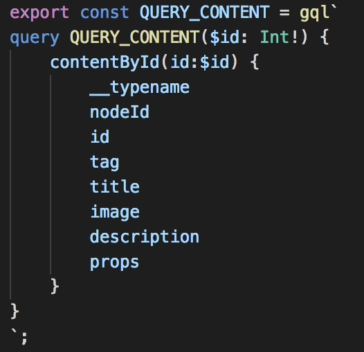
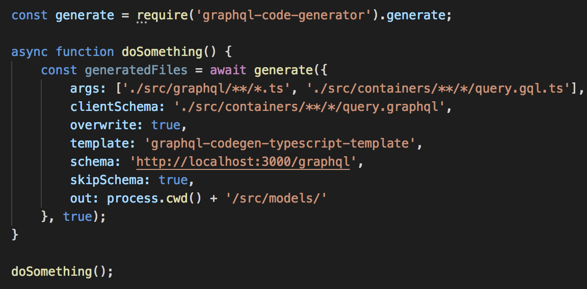
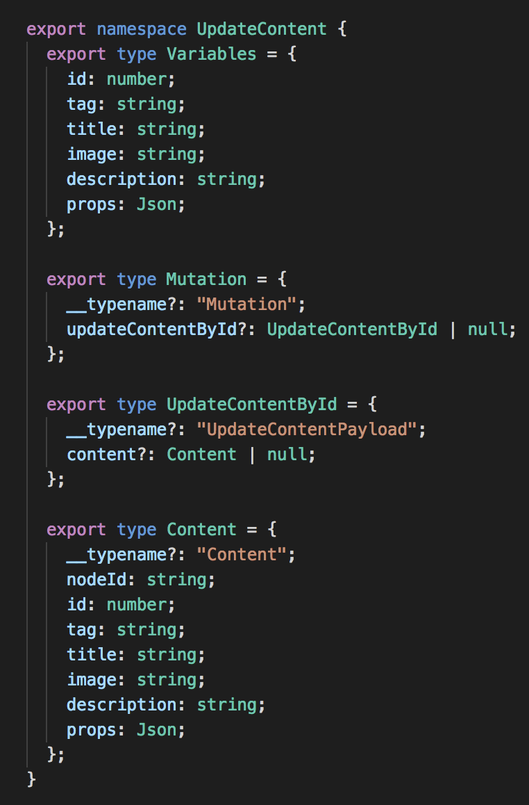
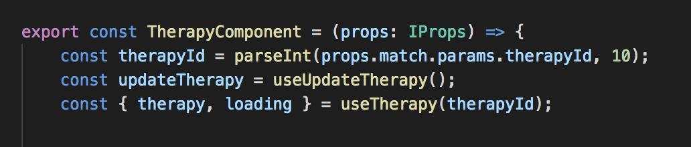

@snap[north]
# @size[1.5em](TypeScript & React)
#### @size[1em](Cesar Toscano)
#### @size[1em](@cesar_tweets)
@snapend

@snap[west span-50]
Backend
* TypeScript
* TypeOrm
* Express
* NestJS
* Postgres
* Graphql
* Postgraphile
@snapend

@snap[east span-50]
Frontend
* TypeScript (again)
* React
* React Apollo
* React Apollo Hooks
* Code Gen
@snapend

---
@title[Slide 2: But First...]

@snap[north]
## @size[1em](But First...)
@snapend

* I'm Hiring: TypeScript / React, Postgres DBA
* We are digitizing behavioral health
* We are building Prescription Digital Therapeutics
* Seeking FDA approval for our app to be prescribed as treatment for chronic illnesses (ex. Diabetus, Heart Disease, Insomnia)
* MIT Undergraduate - 3 years at the Sloan School learning about modeling behavior
* 2 Startup Exits (many founder failures)
* Certified Yoga Teacher
* I'm learning to dance Salsa

---
@title[Slide 3: ]

@snap[north]
## Why TypeScript + React
@snapend

@snap[west span-50]
As a Startup
* Iterate Quickly
* Rich Libraries (yarn)
* Static Code Analysis (vscode)
* Testability (jest, enzyme)
@snapend

@snap[east span-50]
As a Consultant
* Maintainability (nvm)
* Hire-ability
* Readability (ts-lint)
* Reusability
@snapend

---
@title[Slide 4: ]

@snap[north]
## Pipelines
@snapend

@snap[west span-50]
1. Write TypeORM entity
2. Generate, Run Migration
3. Run Postgraphile

This yields a graphql server.
@snapend

@snap[east span-50]
1. Write graphql
2. Run Code Gen
3. Use Hook with Typings

This yields Query Data and Mutations
@snapend

---
@title[Slide 5: ]

@snap[north]
## Scenario: We need Content Management!
@snapend

@snap[west span-50]

@snapend

@snap[east span-50]
`yarn typeorm migration:generate -n Content`

`yarn typeorm migration:run`
@snapend

---
@title[Slide 6: ]

@snap[west span-50]
`yarn start`

## That's it!
@snapend

@snap[east span-50]
## Now for the forntend...

@snapend

---
@title[Slide 7: ]

@snap[west span-50]
`yarn gql-gen` // "gql-gen": "node ./gql-gen.js",

@snapend

@snap[east span-50]

## BOOM!
@snapend

---
@title[Slide 8: Contact Info]

##  How to reach me & Some Reasons Why

* Twitter 
	* Questions right now
	* I'm Hiring! TypeScript / React, Postgres DBA
	* Who should I follow? What should I read?
* Github
	* My public repos
	* Please recommend examples of TypeScript & React
* LinkedIn
	* Do we know anyone?
